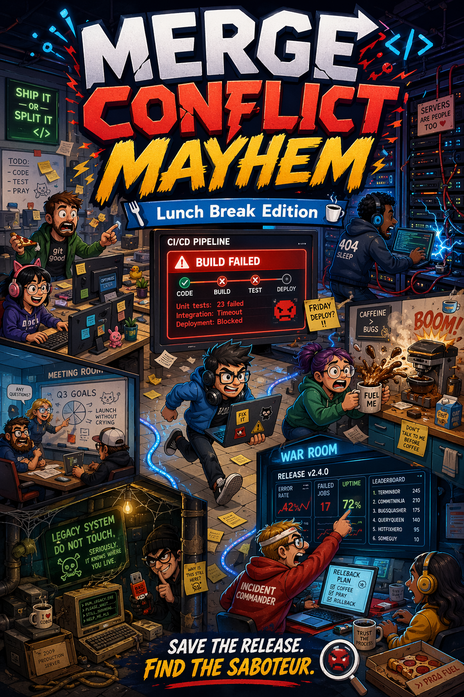

# Merge Conflict Mayhem

<p align="center">
  
</p>

<p align="center">
  <a href="https://github.com/rausch-tech/merge-commit-mayhem/actions/workflows/ci.yml"></a>
  <a href="LICENSE"></a>
  
  
  <a href="https://prod-is-lava.dev"></a>
</p>

Ein Among-Us-artiges Social-Deduction-Game für Tech-Teams. Statt Raumstation: ein Software-Büro mitten im Release. Statt Crewmates und Imposter: Release-Team und Chaos-Agenten. Mit der Mechanik-Klarheit von Among Us und der Insider-Komik eines Engineering-Teams in der Krise.

## Jetzt spielen

**Live (Test-Server):** **https://prod-is-lava.dev** — Browser-Client direkt unter `/`, Godot-3D-Web-Client unter `/godot/`. Beide gegen denselben FastAPI-Backend.

Beide Clients sind feature-vollständig (8 Mini-Games, Sabotagen, Meeting+Voting, Among-Us-Mechaniken, AI-NPC-Bots). Live-Test-Sweep mit echten Spielern steht noch aus — siehe [`docs/ROADMAP.md`](docs/ROADMAP.md) für den aktuellen Stand.

## Schnellstart

Voraussetzungen: Python 3.12 und [`uv`](https://docs.astral.sh/uv/).

```bash
git clone git@github.com:rausch-tech/merge-commit-mayhem.git
cd merge-commit-mayhem
uv sync
uv run uvicorn app.main:app --reload
```

Danach http://localhost:8000 im Browser öffnen.

### Alleine testen (Demo-Mode)

In der Lobby gibt's eine Checkbox „Demo-Mode". Damit kannst du allein eine Runde starten — du wirst automatisch zum Chaos-Agent und siehst die Sabotage-UI. Alternativ kannst du als Host KI-Bots in die Lobby einladen ("+ Bot hinzufügen"), die heuristisch oder LLM-getrieben mitspielen.

### Mit anderen testen

Drei Browser-Tabs (oder echte Geräte im selben Netz) öffnen, je einen Namen + denselben Raumcode eingeben (z. B. `ABCD`), joinen. Der erste Spieler ist Host, sieht „Runde starten". Nach Start bewegen alle sich mit WASD oder Pfeiltasten.

## Tests

```bash
uv run pytest          # 717 Backend-Tests, 92% coverage auf app/game/
npx vitest run         # 109 Frontend-Tests
scripts/godot-check.sh # 22 GDScript-Parse-Checks
```

## Stack

| Layer          | Tech                                                        |
| -------------- | ----------------------------------------------------------- |
| Backend        | Python 3.12, FastAPI, Pydantic v2, asyncio, WebSockets      |
| Browser-Client | Vanilla JS + Canvas                                         |
| 3D-Client      | Godot 4.6, GDScript, KayKit-Assets (CC0)                    |
| Maps + Assets  | JSON + GLTF, alle als Daten im Repo                         |
| AI-NPC-Bots    | Optional via Anthropic Claude API (heuristic-only fallback) |
| Deploy         | EC2 (t4g.nano), Caddy, GitHub Actions                       |

## Architektur (kurz)

- **Backend autoritativ:** FastAPI + WebSockets. Server hält allen Spielzustand, rechnet Positionen, verteilt Rollen, prüft Win-Conditions.
- **Browser-Client:** Vanilla JS + Canvas. Sendet Input-State, rendert empfangene Snapshots. Keine Spiellogik im Browser.
- **Godot-3D-Client (`godot-3d/`):** Godot 4.6, gleicher WebSocket-Vertrag wie der Browser-Client. 3D-Render mit echten KayKit-Assets, holt Map + Kinds-Registry zur Laufzeit vom Backend.
- **Map als Daten:** `maps/*.json` ist Single Source of Truth für Räume, Türen, Spawns, Task-Anker, Möbel. Vom Server validiert + an Client geschickt. `maps/kinds.json` ist die zentrale Registry für MapObject-Typen (Desk, Server-Rack, …) inklusive Asset-Pfade pro Client.
- **Wire-Format:** JSON über WebSocket, camelCase, client-agnostisch. Browser- und Godot-Client teilen sich denselben Server.

## Mehr Doku

- [`docs/ROADMAP.md`](docs/ROADMAP.md) — der vollständige Plan: Vision, Stand, Tier 0–7
- [`docs/ARCHITECTURE.md`](docs/ARCHITECTURE.md) — Backend-Innenleben, Tick-Loop, Controller-Layout
- [`docs/PROTOCOL.md`](docs/PROTOCOL.md) — vollständiger WebSocket-Vertrag
- [`docs/maps.md`](docs/maps.md) — Map-JSON-Schema + MapObject-Kinds
- [`docs/GODOT_HANDOFF.md`](docs/GODOT_HANDOFF.md) — Onboarding für Godot-Entwickler:innen
- [`CONTRIBUTING.md`](CONTRIBUTING.md) — wie du beitragen kannst
- [`CODE_OF_CONDUCT.md`](CODE_OF_CONDUCT.md) — Verhaltensregeln im Projekt
- [`SECURITY.md`](SECURITY.md) — Sicherheitslücken privat melden

## Lizenz

The source code of this project is licensed under the MIT License — see
[`LICENSE`](LICENSE).

Game assets, including logos, artwork, sprites, audio, and branding materials,
are licensed separately. See [`ASSET_LICENSE.md`](ASSET_LICENSE.md) for the
asset terms and `sounds/CREDITS.md` / `images/README.md` for third-party
attributions.
