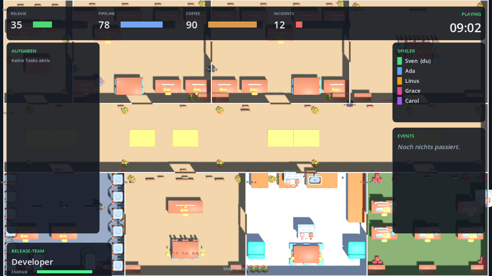
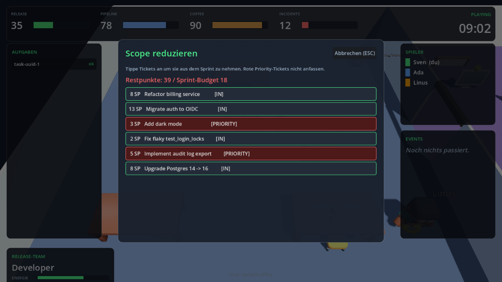

# Merge Conflict Mayhem — Game Overview

Eine kompakte, vollständige Beschreibung des Spiels — gedacht zum Teilen mit
Leuten, die noch keine Runde gespielt haben. Stand: **2026-04-28**, Tier 0–3.9.2
auf Live deployt, parallel Godot-3D-Client (Tier 4) in aktiver Entwicklung.

**Live-Server:** https://prod-is-lava.dev
**Repo:** https://github.com/rausch-tech/merge-commit-mayhem

---

## Was ist das?

Ein **Social-Deduction-Multiplayer-Spiel für Tech-Teams**, gedacht für 4–12
Leute in einer ~10-Minuten-Runde (Mittagspausen-Format). Mechanisch ein
Among-Us-Klon — aber:

- statt Raumstation: ein **Software-Büro mitten im Release**
- statt Crewmates und Imposter: ein **Release-Team** und **Chaos-Agenten**
- statt „Schalter umlegen" Tasks wie **„Pull Request reviewen"**, **„CI/CD
  reparieren"**, **„Logs analysieren"**, **„Kaffee auffüllen"**
- statt „Lichter aus" Sabotagen wie **„PagerDuty-Storm"**, **„Slack-Down"**,
  **„Mandatory Meeting"**, **„Merge Conflict Storm"**

Die Spannungsquelle ist dieselbe wie bei Among Us: **du weißt nicht, wer auf
deiner Seite ist**. Das Release-Team will die Pipeline grün halten und das
Release rausschießen. Die Chaos-Agenten arbeiten heimlich dagegen — sie können
Sabotagen triggern, Mitspieler still „takedownen" (hier: **„Force-Reboot"**)
und durch Server-Tunnel ventilieren.

Das Spielziel ist **nicht** Tech-Wissen, sondern **soziales Lesen** — wer war
wo, wer behauptet was, wer hat eine plausible Story. Die DevOps-Thematik
liefert die Witze und den diegetischen Vorwand dafür, dass man „mal eben in
den Server-Raum musste".

Wir sind eine KI-Firma, deshalb ist **AI durchgehend Teil der Erfahrung**:
Vibe Coder als Chaos-Rolle, AI-flavored Eventfeed-Texte, AI-Postmortem im
Endscreen, und seit Tier 3.9 echte LLM-getriebene KI-Mitspieler (Bots), die
die Lobby füllen wenn weniger als sechs Menschen da sind.

---

## Wie läuft eine Runde ab?

1. **Lobby**: Alle joinen mit einem 4-stelligen Raumcode, der Host startet.
   Server verteilt geheim Rollen — die Mehrheit ist Release-Team, 1 Chaos bei
   ≤6 Spielern, 2 Chaos ab 7, 3 ab 10. Host kann **AI-NPCs** in die Lobby
   einladen (Bot-Promptly, Bot-Cursor-Sr., …) wenn weniger Menschen da sind.
2. **Role-Intro**: Jeder bekommt ein Modal mit seiner Rolle, Stärken/Schwächen,
   aktiver Fähigkeit und drei persönlichen Aufgaben. Release-Team sieht echte
   Tasks, Chaos sieht plausible Tarn-Aufgaben.
3. **Spiel läuft** (15 Minuten Default): Jeder bewegt sich frei durch die
   Map, sieht alle anderen Spieler in Echtzeit, aber **nicht** ihre Rolle.
4. **Release-Team** erledigt persönliche Tasks (PRs reviewen, Tests fixen,
   Logs analysieren, Kaffee holen, …) — jede erfüllte Task pusht den
   **Release-Progress-Balken** Richtung 100 %. Jede Task hat ein eigenes
   **Mini-Game** (alle 8 Tasks haben Mechanik-Plugins, siehe unten).
5. **Chaos-Agenten** triggern Sabotagen — aber nur **am passenden
   Themen-Objekt**: ci_cd_red am CI-Terminal, merge_conflict_storm am
   Git-Terminal, coffee_outage an der Kaffeemaschine usw. Same Anchor wie
   Release-Tasks → Beobachter sehen nicht, ob da gearbeitet oder sabotiert wird.
6. **Wenn ein toter Spieler entdeckt wird** (Body-Discovery), kann jeder
   Lebende den Body reporten → das triggert ein **Emergency Meeting**: alle
   stoppen, Meeting-Screen zeigt Reporter, Body-Ort und letzte Events
   (Hinweise, keine Beweise), 60 s diskutieren + abstimmen.
7. **Win-Conditions** (in Reihenfolge first-to-fire):
   - Pipeline kollabiert (`pipelineStability ≤ 0`) → **Chaos gewinnt**
   - Alle Chaos-Agenten ausgevoted → **Release-Team gewinnt**
   - Release-Progress erreicht 100 % → **Release-Team gewinnt**
   - 15 Minuten Timer abgelaufen → **Chaos gewinnt**
8. **Endscreen** mit Rollen-Reveal, Per-Player-Stats, Awards (Pipeline
   Whisperer, Vibe of the Round, Held der Kaffeemaschine, …), einem
   AI-styled Postmortem-Text und einem **„Last-Words"-Zitat** des
   eliminierten Spielers (team-spezifischer Pool).

---

## Rollen + Teams

### Release-Team (5 Rollen)

Jede Rolle hat **Stärken** (× 1.35 Task-Speed in passenden Kategorien),
**Schwächen** (× 0.75), ein **Coffee-Profil** und meist eine **aktive
Fähigkeit** (1× pro Runde).

| Rolle                  | Stärken             | Coffee-Profil        | Fähigkeit                                                         |
| ---------------------- | ------------------- | -------------------- | ----------------------------------------------------------------- |
| **Developer**          | Code (PRs, Tests)   | normal               | —                                                                 |
| **DevOps Engineer**    | Infra, CI/CD        | hohe Abhängigkeit    | **Rollback** — +18 Pipeline-Stability                             |
| **QA Lead**            | Tests, Legacy, Logs | stabil (sip slow)    | **Reproduce Bug** — markiert letzte Aktivität als fragwürdig      |
| **Scrum Master**       | Scope, Process      | leicht reduziert     | **Standup** — ruft zusätzliches Meeting (auch außerhalb War Room) |
| **Caffeine Collector** | Support (Kaffee)    | sehr stabil, max 130 | **Coffee Run** — bufft alle Nachbarn mit +35 Coffee               |

Singleton-Cap: DevOps, QA, Scrum Master und Caffeine Collector gibt's max. 1×
pro Runde. Wunschrolle in der Lobby wählbar — Server respektiert best-effort.

### Chaos-Agenten (3 Varianten)

Unterscheiden sich in den verfügbaren Sabotagen — alle drei sehen für
Außenstehende identisch aus.

| Rolle                | Theme         | Verfügbare Sabotagen                                                          |
| -------------------- | ------------- | ----------------------------------------------------------------------------- |
| **Vibe Coder**       | AI/Code-Chaos | ci_cd_red, flaky_tests, merge_conflict_storm, fake_customer_request           |
| **Rogue Consultant** | Process/Scope | mandatory_meeting, fake_customer_request, coffee_outage, merge_conflict_storm |
| **Shadow Admin**     | Infra-Outages | lights_out, comms_outage, ci_cd_red, mandatory_meeting                        |

Chaos-Wunsch in der Lobby wird silently ignoriert — Verteilung bleibt random
(Geheimhaltung).

### Spectator-Mode

Eliminierte Spieler werden zu Geistern. Sie können weiter Tasks erledigen
(helfen dem Release-Team auch nach Tod), sehen andere Geister, bewegen sich
frei — aber nicht mehr abstimmen oder reporten. Lebende sehen sie nicht.

---

## Persönliche Tasks (statt geteiltem Pool)

Jeder Spieler bekommt zu Rundenbeginn **3 persönliche Aufgaben**:

- **Release-Team**: 2 Tasks aus den Stärke-Kategorien der Rolle + 1 freie. Im
  HUD mit ★ markiert. Andere Tasks dürfen auch erledigt werden, aber langsamer.
- **Chaos-Agenten**: 3 Fake-Tasks passend zur Tarn-Persona. Wer Vibe Coder ist,
  kriegt Code-Tasks als Tarnung — Beobachter sehen denselben Busy-State wie
  bei echter Arbeit.

**Warum das wichtig ist:** Persönliche Tasks erzeugen automatisch:

- bessere **Alibis** („Ich war im Server Room, weil ich Deployment fixen
  musste")
- stärkere **Verdächtigungen** („Warum war der Scrum Master beim CI-Terminal?
  Das ist nicht seine Aufgabe")
- mehr **Diskussionsstoff** in Meetings

---

## Mini-Games

**Alle 8 Tasks haben Mini-Games.** Jeweils kleines Modal-Spiel mit klarem
Mechanik-Pattern, server-authoritativ implementiert (Plugin-Framework,
Server ist Master, Client mirror'd):

| Task                  | Mini-Game-Mechanik                                               |
| --------------------- | ---------------------------------------------------------------- |
| `fix_unit_tests`      | **Test-Suite-Repair** — sequencing                               |
| `analyze_logs`        | **Log-Filter** — filter-by-criterion                             |
| `repair_deployment`   | **Cable-Pairing** — pairing                                      |
| `refill_coffee`       | **Coffee-Pour** — timing                                         |
| `reduce_scope`        | **Sprint-Trim** — subset-by-constraint                           |
| `review_pr`           | **Diff-Review** — multi-select-by-criterion (Spot-the-Bug)       |
| `calm_legacy_service` | **Stability-Balance** — alle drei Metriken im grünen Band halten |
| `write_release_notes` | **Release-Notes** — click-to-cycle-sort                          |

Bots **skippen** Mini-Games — sie haben das Mechanik-Spiel nicht zu spielen,
sondern halten den Task einfach 4–6 s und das gibt den Reward. Das ist eine
bewusste Design-Entscheidung: Bots sollen Räume füllen, nicht Mini-Games
durch DOM-Klicks gewinnen.

---

## Coffee-Energy als Ressource

Jeder Spieler hat **eigene Coffee-Energy** (0..max). Decay 1.4/s × Rolle-Modifier.

- **≥ 80 Coffee** → Task-Bonus
- **15..79 Coffee** → normal
- **< 15 Coffee** → Speed-Penalty + Movement-Slowdown

Refill-Optionen:

- **`refill_coffee`-Task** in der Kitchen → eigene Energy auf max + +15 für
  Nachbarn in 180 px (kleiner Splash, wenn man zusammen am Tisch steht)
- **Coffee Run** (Caffeine-Collector-Ability) → +35 Coffee an alle in 220 px
- **`coffee_outage`-Sabotage** → setzt globalen Team-Coffee auf 0, halbiert
  alle Spieler auf 40 % ihrer Max-Energy

Der Caffeine Collector ist die einzige Rolle, die über 100 Coffee speichern
kann (max 130).

---

## Sabotagen — an Themen-Objekte gebunden

Acht Sabotagen, jede mit Cooldown und einem **Object-Type-Anchor** auf der
Map. Chaos kann eine Sabotage **nur** triggern, wenn er innerhalb 60 px eines
passenden Anchors steht — und der Anchor ist **derselbe** wie für die
zugehörige Release-Task.

| Sabotage              | Effekt                                    | Object-Type                        | Trigger-Ort (Default-Map)            |
| --------------------- | ----------------------------------------- | ---------------------------------- | ------------------------------------ |
| CI/CD Rot             | Pipeline -20                              | `ci_console`                       | Server Room (an `repair_deployment`) |
| Flaky Tests           | Incidents +30                             | `qa_terminal`                      | Open Space (an `fix_unit_tests`)     |
| Merge Conflict Storm  | Pipeline -10, Incidents +25               | `git_terminal`                     | Open Space (an `review_pr`)          |
| Coffee Outage         | Team-Coffee = 0; alle auf 40 % Max-Energy | `coffee_machine`                   | Kitchen (an `refill_coffee`)         |
| Mandatory Meeting     | 5 s alle langsam                          | `meeting_screen`                   | Meeting Room (an `reduce_scope`)     |
| Fake Customer Request | Release -15                               | `release_console`/`meeting_screen` | Meeting Room                         |
| PagerDuty-Storm       | Vignette: Sicht reduziert auf 150 px      | `monitoring_panel`                 | Server Room (an `analyze_logs`)      |
| Slack-Down            | Tasks + andere Sabotagen blockiert        | `monitoring_panel`/`ci_console`    | Server Room                          |

**Why same anchor:** Wenn der Trigger-Spot ein eigenes „Sabotage-Terminal"
wäre, wäre jeder, der dort steht, sofort verdächtig. Same Anchor → Beobachter
sehen „X arbeitet am CI-Terminal" und müssen raten, ob das eine Repair, eine
echte Task oder eine Sabotage ist.

PagerDuty-Storm und Slack-Down haben zusätzlich **Repair-Panels** (50-px-
Reichweite), an denen jeder Lebende sie reparieren kann.

---

## Vents (Chaos-only)

Vorab definierte Tunnel-Punkte auf der Map. Chaos-Agent steht in 50-px-Nähe
→ drückt **V** → cycelt durch die verbundenen Ziel-Vents → wird sofort
dorthin teleportiert. Andere sehen die Vents als Map-Architektur, können sie
aber nicht nutzen.

3 Vents auf der Default-Map, vernetzt zwischen Open Space, Server Room und
Legacy Basement. Strategischer Wert: schnell zum Tatort, weg vom Body, oder
hinter eine plausible Alibi-Position.

---

## Take-Down + Body-Discovery

**Take-Down (Chaos):** Chaos in 40-px-Nähe eines lebenden Mitspielers →
Button **„Force-Reboot"** → Target wird `isAlive=false`, ein Body bleibt
liegen, Cooldown 25 s. Server validiert alles authoritativ. Im War-Room
(Sicherheitszone) ist Force-Reboot gesperrt.

**Body-Discovery + Report:** Sobald ein Body von einem **lebenden** Spieler
entdeckt wird (in Reichweite), kann er ihn reporten → Meeting wird
ausgelöst. Wenn niemand reportet, bleibt der Body liegen — taktisch
interessant für Chaos.

---

## Meetings + Voting

Im Meeting (60 s) zeigt der Meeting-Screen:

- **Reporter** (wer hat den Body gefunden, oder wer hat das Emergency
  ausgerufen)
- **Body-Ort** (z. B. „Body von Anna im Server Room")
- **Letzte 6 Events** (Sabotagen, Repairs, Reports — als Diskussionsfutter,
  nicht als Beweis)
- **Voting-Liste** der Lebenden

Jeder Lebende kann **eine** Stimme abgeben (für einen Spieler oder Skip).
Re-Vote überschreibt. Nach 60 s oder wenn alle voted haben → höchste Anzahl
wird eliminiert (Skip oder Tie → niemand). Geister dürfen nicht voten.

Zusätzlich kann jeder Spieler **einmal pro Runde** ein Emergency-Meeting aus
dem War-Room rufen, auch ohne Body. Der Scrum Master kann zusätzlich via
Standup-Ability ein Meeting auch außerhalb des War-Rooms triggern.

---

## Endscreen + AI-Postmortem

Nach Spielende werden Rollen aufgedeckt und das Server-Side `final_summary`
zeigt:

- **Per-Player-Stats**: Tasks erledigt, Sabotagen ausgelöst, Coffee am Ende,
  Ability genutzt, lebt/tot
- **Awards** (kuratiert aus den Stats):
  - Pipeline Whisperer — meiste Tasks
  - Vibe of the Round — meiste Sabotagen
  - Held der Kaffeemaschine — höchste End-Coffee-Energy
  - Most Suspicious Innocent — Release-Spieler, der ausgevoted wurde
- **Last-Words-Zitat** unter dem Verdict-Toast — team-spezifischer
  Flavor-Pool, gibt dem eliminierten Spieler einen letzten Satz
- **AI-Postmortem** — mehrzeiliger LLM-styled Text, generiert aus dem
  Round-Summary. Liest sich wie _„Generated by Claude (vibes-only mode). Das
  Release-Team hat es über die Linie gebracht. Knapp, mit viel Kaffee und
  weniger Würde als erhofft."_

Das ist der Moment, in dem Leute lachen und „noch eine Runde" sagen.

---

## AI-NPCs (Bots) als Lobby-Filler

Seit Tier 3.9.2 kann der Host **AI-NPCs** in die Lobby einladen, wenn nicht
genug Menschen da sind. Sie laufen LLM-getrieben durch die Map, completen
Tasks, melden Bodies wenn sie welche sehen, voten in Meetings.

- **Curated Names:** Bot-Promptly, Bot-Cursor-Sr., Bot-StackOverflow,
  Bot-Junior, Bot-Copilot, Bot-Linter, Bot-Pager, Bot-Standup. Im Spiel mit
  `[BOT]`-Tag über dem Sprite, in der Lobby mit Kick-Button.
- **LLM-Layer:** `LLMClient` Protocol mit zwei Providern — Anthropic Claude
  Haiku als Default, oder lokales OpenAI-kompatibles (z. B. Ollama mit
  Gemma 4). Auswahl per Env-Vars. Ohne Provider laufen Bots heuristisch
  (random Task-Pick), das Spiel funktioniert auch komplett ohne LLM.
- **Was geht ans LLM:** nur high-level Intent („welche Task als nächstes")
  alle 5 s pro Bot. Pathfinding, Movement, Voting, Body-Report sind alle
  deterministisch im Server. LLM-Call läuft im ThreadPool — der Tick-Loop
  blockiert nicht, auch wenn Anthropic mal langsam ist.
- **Phase 1: nur Release-Team-Bots.** Chaos-Bots (Phase 2) brauchen
  Game-Sense (Timing, Alibi-Building) und sind eigener Slice.

---

## Map

Aktuell **vier Maps** wählbar in der Lobby (Pydantic-validiert beim
Server-Start, an den Client per `room_joined` geliefert):

| Map              | Größe     | MapObjects | Räume | Stand                    |
| ---------------- | --------- | ---------- | ----- | ------------------------ |
| `default-office` | 4800×3200 | 44         | 6     | Showcase, balanciert     |
| `office-complex` | 4800×3200 | **390**    | 9     | Wow-Effekt, KayKit-Möbel |
| `datacenter`     | 4800×3200 | 147        | 10    | Server-Racks dominieren  |
| `small-arena`    | 1600×1200 | 14         | 3     | Schnelle Test-Runden     |

Die Default-Map hat sechs Räume mit klarer Identität:

| Raum            | Funktion                                                    |
| --------------- | ----------------------------------------------------------- |
| Open Space      | Hub, Code-Tasks (PR, Tests), Git-Terminal                   |
| Server Room     | DevOps, CI/CD, Monitoring, PagerDuty-Repair, Logs           |
| Kitchen         | Kaffee, Caffeine-Collector-Hub                              |
| Meeting Room    | Scrum, Scope, Release-Notes, Mandatory-Meeting-Trigger      |
| Legacy Basement | Legacy-Service, riskanter isolierter Raum                   |
| War Room        | Slack-Down-Repair, einziger Spawn-Ort für Emergency-Meeting |

`maps/kinds.json` ist die **Single Source of Truth** für MapObject-Kinds
(25 Kinds wie `desk`, `server_rack`, `coffee_machine`, …) — Server validiert
Maps dagegen, Browser-Frontend / Editor-3D-Vorschau / Godot-Client lesen
alle dynamisch via `GET /api/kinds`. Ein neues Möbelstück wird einmal in
`kinds.json` ergänzt und ist überall verfügbar.

Ein **Map-Editor** unter `/editor` erlaubt nicht-coderischen Map-Bau —
2D-Canvas + Three.js-3D-Vorschau Side-by-Side, Save direkt zum Server,
Undo/Redo, Validation-Strip.

---

## Tech-Stack

- **Backend:** Python 3.12 + FastAPI + Pydantic v2 + asyncio. 20-Hz-Tick-Loop.
  WebSocket-Endpoint `/ws`. Authoritativ für **allen** State.
- **Browser-Client:** Vanilla HTML/CSS/JS + `<canvas>`-Renderer. Keine
  Build-Pipeline, keine Frameworks. Spielbar auf Phone, Tablet, Desktop.
- **Godot-3D-Client (Tier 4):** Godot 4.6 mit echten KayKit-Assets. Gleiches
  WebSocket-Protokoll, fetcht Map + Kinds-Registry zur Laufzeit vom Backend
  (keine Drift). Web-Export läuft als CI-Gate.
- **AI-Layer:** `LLMClient` Protocol + Anthropic Haiku oder lokales
  OpenAI-kompatibles (Ollama). LLM-Calls non-blocking im ThreadPool.
- **Hosting:** AWS EC2 t4g.nano in eu-central-1, Caddy als HTTPS-Reverse-
  Proxy, GitHub-Actions-Auto-Deploy auf jedem `main`-Push.
- **Tests:** ~714 Backend (pytest) + ~109 Frontend (vitest) + Godot-Parse-
  Check als CI-Gate. Coverage-Floor 88 % auf `app/game/`, aktuell ~92 %.
- **Performance:** Tick-Compute p99 = 0.6 ms bei 12 Spielern (~84× Headroom
  auf das 50-ms-Tick-Budget). Server-CPU ist nicht der Bottleneck.

**Architektur-Nordstern: Python entscheidet, der Client zeigt nur an.** Nichts
an Spiellogik im Frontend. Wenn eine Idee Spiellogik in den Client drückt,
geht sie zurück.

---

## Aktueller Stand (2026-04-28)

**Was funktioniert auf Live:**

- 4–12 Spieler joinen, Lobby mit Map-Auswahl + **Wunschrolle**, Multi-Chaos
  ab 7 Spielern
- **5 Release-Rollen + 3 Chaos-Rollen** mit unterschiedlichen Stärken,
  Schwächen, Coffee-Profilen und aktiven Fähigkeiten
- **Persönliche Task-Backlogs** (3 pro Spieler) — echte Tasks für Release,
  Fake-Tasks für Chaos
- **Coffee-Energy pro Spieler** mit Decay, Refill, Splash, Speed-Effekten
- **Sabotage-Object-Binding** — jede Sabotage am themen-passenden Anchor
- **Alle 8 Tasks haben Mini-Games** (Sequencing, Pairing, Timing,
  Filter-by-Criterion, Subset-by-Constraint, Spot-the-Bug,
  Stability-Balance, Click-to-Cycle-Sort)
- **AI-NPCs (Bots)** als Lobby-Filler, Anthropic-LLM-getrieben oder lokal
  via Ollama
- **AI-Flavor + AI-Postmortem + AI-Last-Words** per LLM-styled Pools
- Komplettes Among-Us-Feature-Set: Movement, Tasks, Sabotagen, Vents,
  Take-Down, Body-Discovery, Report, Voting, Spectator-Mode
- **Role-Intro-Modal**, **Personal-Task-Panel**, **Coffee-Meter-Pille**,
  **Ability-Button**, **Meeting-Kontext**, **Endscreen mit Awards**
- Mobile-Touch-Controls (spielbar auf Phone)
- Reconnect (30 s Grace nach Disconnect)
- Map-Editor unter `/editor` mit 3D-Vorschau (Three.js)
- **Vier Maps** wählbar (default, office_complex mit 390 Möbeln, datacenter,
  small-arena), kinds.json als Single Source of Truth
- Metrik-Export (JSONL pro Tag) für Balancing, lesbar via `GET /api/metrics`
- **Godot-3D-Client** parallel auf gleichem WS-Protokoll (Tier 4 in Arbeit)

**Was offen ist:**

- **Tier 3.9.3** AI-Postmortem mit echtem LLM (statt Templates)
- **Tier 3.9.4** AI-Game-Master / Live-Commentary
- **Tier 3.9.5** AI-Meeting-Summary
- **Tier 3.9.6** Chaos-Bots (Phase 2 — schwierig wegen Game-Sense)
- **Tier 4.x** Godot-Client Feature-Parität (Persona-Layer, einzelne
  Polish-Slices)
- **Pathfinder MapObject-aware** für Bots (heute room+door-only)

---

## Wo Brainstorming-Input besonders hilft

1. **AI-Features auf der Roadmap** — was wäre der spannendste nächste
   AI-Touch? Live-Commentary? Per-Player-Prompts? In-Round LLM-NPC-Dialoge?
2. **Game-Modes neben Among-Us-Klon** — z. B. Bot-Arena (siehe
   `BOT_ARENA_VISION.md` als Brainstorm-Skizze), Coop-Modi ohne Chaos?
3. **Erweiterte Rollen** (Bug Squasher, Data Wizard, Legacy Oracle, Incident
   Commander)
4. **Map-Themen** (Hackathon-Garage, Konferenz-Lounge, Open-Office-Hellscape, …)
5. **Insider-Gags + Eventtexte** — der Pool ist erweiterbar ohne Code
6. **Voting-Polish** — Accusation-Tags („sus", „war mit mir", „hat Body
   reported")

---

## Wie ihr selbst spielen könnt

1. https://prod-is-lava.dev öffnen (Phone, Tablet, Desktop)
2. Raumcode ausdenken (4 Buchstaben), Namen eintragen, optional Wunschrolle
   wählen, **Join**
3. Andere joinen mit gleichem Code — alternativ Host-Knopf **„+ Bot
   hinzufügen"** für AI-Mitspieler
4. Host (= erster im Raum) startet die Runde
5. **WASD/Arrows** zum Bewegen, **E** für Tasks, **F** für Sabotage-Repair,
   **V** für Vent (nur Chaos), **Klick** auf Sabotage-Buttons (nur Chaos),
   **Klick** auf Ability-Button (Rolle-spezifisch)
6. Bei Body-Fund: Report-Button. Bei Verdacht ohne Body: ins War-Room laufen
   und Emergency-Meeting

Mindestens 4 Spieler (oder Spieler+Bots) für eine sinnvolle Runde,
Sweet-Spot 6–10.

---

## Was wir NICHT vorhaben (bewusste Scope-Limits)

- Keine Persistenz (kein Login, kein Profil — bewusst minimal für interne
  Mittagspausen)
- Kein Free-Form-Chat (Voice nebenher auf Slack/Discord; im Spiel nur
  Eventfeed + Voting)
- Keine Microtransactions, keine Werbung
- Kein öffentliches Release vor Tier 7

Brainstorming sollte sich an dem Setup orientieren — Vorschläge die das
brechen sind nicht falsch, aber wären ein Pivot.

---

## Quellen / Weiterlesen

- `docs/ROADMAP.md` — sieben Tier in Reihenfolge, was done und was offen
- `docs/PROTOCOL.md` — vollständiger WebSocket-Vertrag (für alternative
  Clients)
- `docs/ARCHITECTURE.md` — Backend-Organisation + Performance-Numbers
- `docs/maps.md` — Map-JSON-Schema (für Map-Bauer)
- `docs/GODOT_HANDOFF.md` — Onboarding für den Godot-3D-Client
- `merge_conflict_mayhem_project/merge_conflict_mayhem_gesamtfeedback.md` —
  externes Brainstorming-Feedback, das Tier 3.5/3.6/3.7 begründet hat
